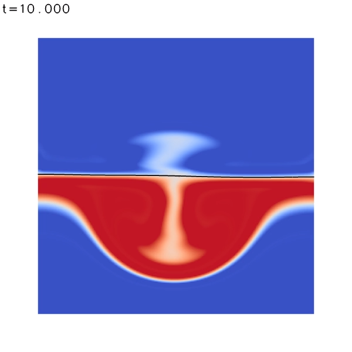

# Bioreactor project reproducible result

This is a folder meant to aid generating the reproducible result for the bioreactor project. The data for which the uncertainty should be calculated is a measure of mixing over time in a rocking wave bioreactor, an image to give some idea of what is happening in the reactor during these simulations is provided below.

The Python notebook plus the data given should be sufficient to generate the reproducible result. Open the notebook using your softaware of choice and run the cell. This will output a graph of mixing coefficient over time for two different viscosities. This is done to allow an estimate of the uncertainty associated with the unknown parameter for the viscosity during the growth of cells in the reactor. An estimate of this uncertainty is printed to the terminal but feel free to use the data extracted by the script to generate alternative unceratinty measures.

The own_data folders contain semi-compiled basilisk scripts alongside a bash file which should fully compile and run them on any machine that can compile C code. Detalied instructions are provided in the appendix of the report.

